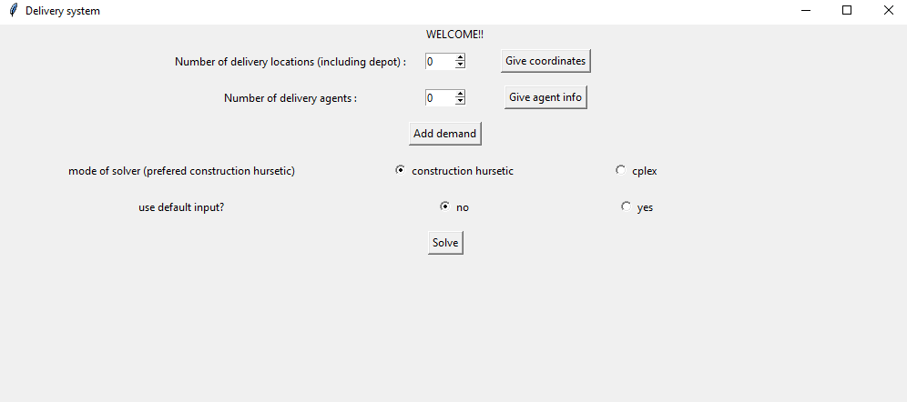

This project was part of [I4 challenge](https://twitter.com/iitdelhi/status/1245606188718239745?s=20)  by IIT Delhi
## Introduction
We were supposed to build a simple software for grocery delivery managment which boils down to Capacitized Vehicle Routing Problem([CVRP](https://en.wikipedia.org/wiki/Vehicle_routing_problem))..
So we took two approches for problem. One was to solve CVRP instance exactly using [Integer Linear Programming](https://en.wikipedia.org/wiki/Integer_programming) and other was to use hurestice approch 
mainly [Construction Hurestic](https://en.wikipedia.org/wiki/Constructive_heuristic). The detailed implementation can be found [here](./gallery/report_i4_4.pdf)
#### Construction Hurestics
Here the program start with instance of solution where delivery agents are sent to extreme points. The recursively add city to agent's path if it valid solution and increase in cost is minimum.  When all cities are assigned to path it performs Large Neigbhourhood Search (LNS) to move from local minima. This involve destroying some small part of solution by unassigning some cities and then again use same recursive logic to update solution.
#### CPLEX
Some trivial constraints are defiend in requirment of CPLEX solver. Then problem is handed to solver.

## Requirments
1. Python with numpy, tkinter, matplotlib, cplex
2. C++ compiler
## Getting Started
Run 
<pre>
<code>python main.py</code>
</pre>
It will open main panel image 1 from [Galary](#gallery). Follow the steps:
1. Enter number of cities. Consider depot as one of the city. So if you have want solution for 1 depot and 5 cities then you have to enter 6 cities.
2. Add (x,y) coordinates after filling positive number of cities and pressing give coordinates button. Depot city is assumed to be at (0,0) so will only ask for 5 city coordinates.
3. Add postive number of delivery agents.
4. To add capacities of delivery agents press Give agen info button.
5. Add city demands by pressing add demand button
6. Use solver mode
7. Choose input type. If you choose default all information you filled above will be overwritten by default values.
## Gallery
1.The main Panel 

 
2.Hurestic Input 

 
3.Hurestic Output 

 
4.Cplex Input 

 
5.Cplex Output 

