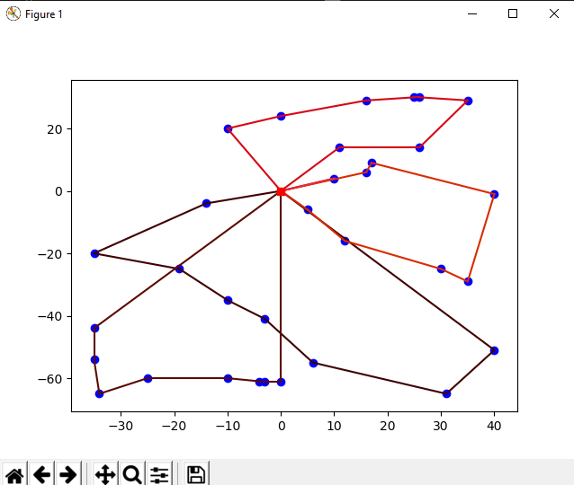

This project was part of [I4 challenge](https://twitter.com/iitdelhi/status/1245606188718239745?s=20)  by IIT Delhi
## Description
We were supposed to build a simple software for grocery delivery managment which boils down to Capacitized Vehicle Routing Problem([CVRP](https://en.wikipedia.org/wiki/Vehicle_routing_problem))..
So we took two approches for problem. One was to solve CVRP instance exactly using [Integer Linear Programming](https://en.wikipedia.org/wiki/Integer_programming) and other was to use hurestice approch 
mainly [Construction Hurestic](https://en.wikipedia.org/wiki/Constructive_heuristic). The detailed implementation can be found here 
## Requirments
numpy, tkinter, matplotlib, cplex
Run 
<pre>
<code>python main.py</code>
</pre>
## Gallery
1.The main Panel 

 
2.Hurestic Input 

 
3.Hurestic Output 

 
4.Cplex Input 

 
5.Cplex Output 

